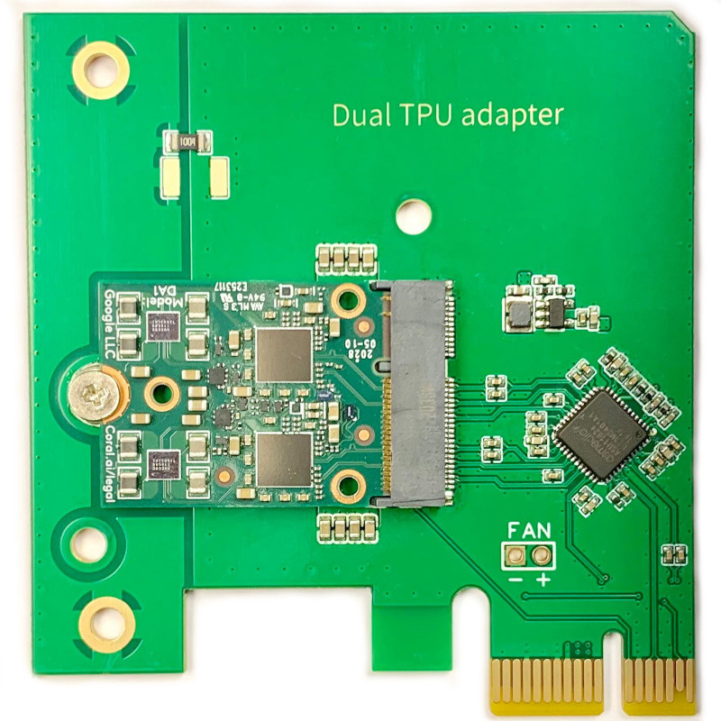
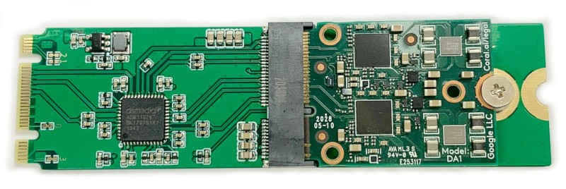
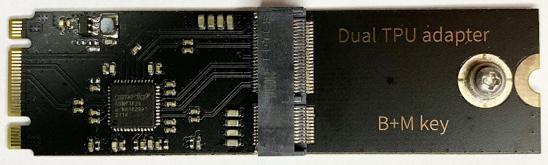
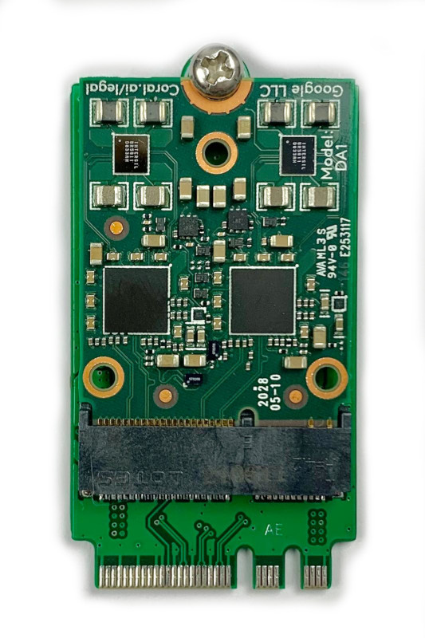

# Dual Edge TPU Adapter
Dual Edge TPU Adapter to use it on a system with single PCIe port on m.2 A/B/E/M slot or desktop PCIe x1

# Adapter types
## Low profile PCIe x1 version
For Dual Edge TPU to be used in desktop PCIe x1 slot

[Order online](https://www.makerfabs.com/dual-edge-tpu-adapter.html)

Store updates [on GitHub issues](https://github.com/magic-blue-smoke/Dual-Edge-TPU-Adapter/issues/8)

Follow on [Twitter](https://twitter.com/magic__smoke)

[Waiting list](https://mbs-shop.online/waitinglist)

## m.2 BM version
For Dual Edge TPU to be used in m.2 B- or M-key slot

[Waiting list](https://mbs-shop.online/waitinglist)

m.2 B+M 2280 hand soldered prototype:

m.2 B+M 2280:

## m.2 AE version
For Dual Edge TPU to be used in m.2 A- or E-key slot

## Why would I need an adapter for Coral Dual Edge TPU?
Coral Dual Edge TPU is one card with two identical TPU cores. Each core has it's own PCIe interface and motherboard shall have two PCIe busses on m.2 slot to make them both work. 

E-key slot implemented to full m.2 electomechanical specification has two PCIe busses. Most motherboard manufacturers implement only one PCIe bus in m.2 E-key connector (this is why only one TPU is working). Some SBCs can have only USB bus on m.2 connector, ie none of TPUs will work.

**Important**: it's all about number of PCIe busses, not number of PCIe lanes. Only A- and E- key m.2 slots implemented to a full specification have two busses. 

One PCIe bus on m.2 E-key connector is not end of the World. With PCIe switch bus can be split in two busses at cost of slightly increased latency and shared bandwidth.

Below are Q&As:

### I see only one TPU when using card in m.2 E-key slot
Seems your motherboard manufacturer routed only one PCIe bus to E-key connector. Another option is that PCIe bus is multiplexed between regular PCIe slot and m.2. Check instructions manual or contact motherboard manufacturer to see if something can be done. 

To make both cores working you can:
- get a new motherboard that explicitly specifies two PCIe busses on m.2 E-key slot. Some good known motherboards are documented here: https://github.com/google-coral/edgetpu/issues/256
- express your interest in active switching E-key adapter here: https://github.com/magic-blue-smoke/Dual-Edge-TPU-Adapter/issues/5
- use Coral Dual Edge TPU in PCIe x1 slot with Low profile PCIe x1 adapter (see below)

### I have only m.2 B/M slot for SSD, is there some kind of adapter for Coral Dual Edge TPU card?
First, make sure your m.2 slot has PCIe bus, because m.2 B and M slots can support NVMe, SATA or both interfaces. You'd need slot to support NVMe or both, NVMe and SATA interfaces. With latter, motherboard automatically detects type of m.2 card and muliplexes PCIe or SATA accordigly to configuration pins on m.2 card. With passive adapter you'll see only one TPU core. I've successfully prototyped active adapter that makes both cores work. Please express your interest here: https://mbs-shop.online/waitinglist

### I'd like to use Coral Dual Edge TPU with desktop PCIe x1 slot
There are m.2 E-key to desktop PCIe adapters, but those passively pass one PCIe interface to the card, ie only one TPU core will work. To make both cores work I've developed and manufactured adapters. First production run is sold out, you can apply for a waiting list here: https://mbs-shop.online/waitinglist

# Placeholder for non-dual TPU issues and non-compatibility 
- M.2 E-key slot for WiFi card can have CNVio interface instead of PCIe. No TPU(s) will be detected if it's CNVio
- SATA only m.2 B/M key slots are not compatible
- USB to m.2 SATA eclosures are not compatible
- USB to m.2 NVMe enclosures are not tested, but I expect this option will NOT work. USB to PCIe bridge here is not transparent, ie NVMe drive will not show up as PCIe device in system. Instead, bridge IC implements USB Mass Storage Class on USB side and translates these transfers to PCIe NVMe commands. 
