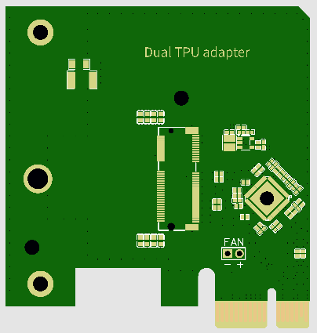
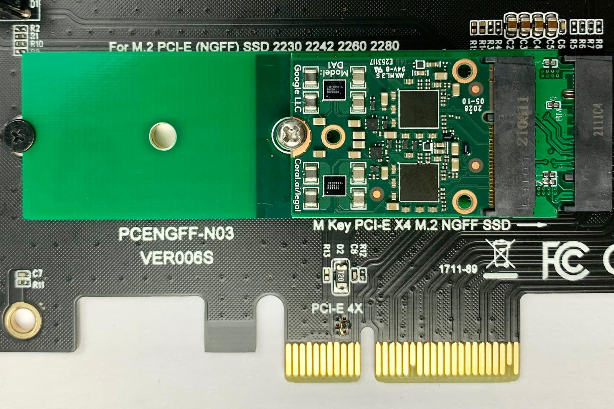

# Dual-Edge-TPU-Adapter
Dual Edge TPU Adapter to use it on a system with single PCIe port on m.2 A/B/E/M slot or desktop PCIe x1

# Low profile PCIe x1 version
[Availability](https://github.com/magic-blue-smoke/Dual-Edge-TPU-Adapter/issues/4)

# m.2 AE version

# m.2 BM version with NVMe to PCIe adapter

